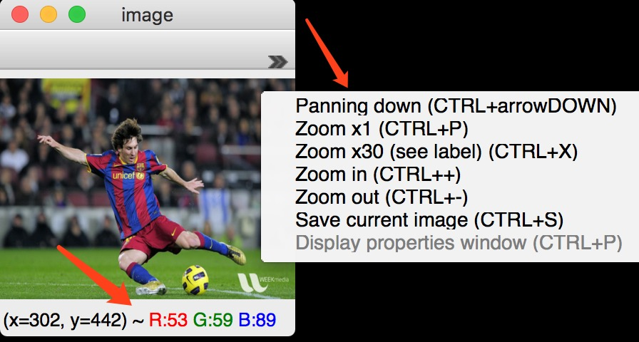

- 网址：
    - https://github.com/skvark/opencv-python
    - https://pypi.python.org/pypi/opencv-python

## 最快
- 安装好pip和virtualenv
- pip install -i http://mirrors.aliyun.com/pypi/simple/ --trusted-host mirrors.aliyun.com  -r requirements_cv.txt

## 安装 opencv-python
- virtualenv -p python3 .cv2
- source .cv2/bin/activate
- pip install opencv-python
- pip install matplotlib
- 验证 
    - python -c "import cv2;print(cv2.\_\_version__,cv2.\_\_doc__,cv2.\_\_file__)"

## 安装 opencv-contrib-python
强烈建议先卸载opencv-python
- pip uninstall opencv-python
- pip install opencv-contrib-python
- 验证 
    - python -c "import cv2;print(cv2.\_\_version__,cv2.\_\_doc__,cv2.\_\_file__)"
    - python -c "import cv2;print(help(cv2.CascadeClassifier))"

- 运行,2个特性
    - 鼠标指向某个像素，提示栏会显示当前坐标和RGB数据
    - 工具栏有很多实用的功能，可惜不能显示图标
    - 
##
软件包包含预编译的OpenCV二进制文件和Python绑定。 
这可以为Python提供超快速（通常<10秒）OpenCV安装。 

如果您只需要OpenCV Python绑定，则不需要单独的OpenCV安装。 

**重要提示** 

MacOS和Linux的轮子目前有一些局限性： 

- 不支持视频相关的功能（不用FFmpeg编译），但支持摄像头。可以使用scikit-learn-videos去读取
- 例如``cv2.imshow（）``将不起作用（没有使用GTK + 2编译） x或碳支持） #可以使用matplotlib来显示

## 常见问题
**问：我还需要单独安装OpenCV吗？** 

A：不，包是特殊的轮二进制包，它们已经包含静态构建的OpenCV二进制文件。 

**问：pip没有找到包``opencv-python``？**

A：轮包格式和manylinux构建是非常新的东西。最可能的问题是与旧的点相关联，可以通过运行``pip install -upgrade pip``和``pip install wheel``来修复。 

**问：我需要contrib模块？ 

A：请安装`opencv-contrib-python <https：pypi.python.org =“”pypi =“”opencv-contrib-python =“”> _ _ 然而， 注意，一些国家的商业用途可能受到限制，因为contrib模块包含一些非免费/专利算法。

** Q：导入在Windows上导致某些DLL加载错误？ 

A：如果导入在Windows上失败，请确保您具有“Visual C ++可再发行2015”（https：www.microsoft.com =“”en-us =“ “download =”“details.aspx？id =”48145“>`__ installed。如果您使用的Windows版本低于Windows 10，并且没有安装最新的系统更新，则通用C运行时版本

** Q：为什么我不能在gnu/linux发行版X或macOS上打开视频文件?

A：OpenCV视频i/o很大程度上依赖于FFmpeg。许多linux和macOS OpenCV二进制文件都不是针对它编译的。
这些包的目的是为OpenCV Python绑定提供尽可能简单的安装体验，并且它们应该直接工作。
如果没有一个“通用的”FFmpeg构建(例如在Windows车轮上的LGPL许可构建)，将FFmpeg添加为额外的依赖项，那么实现这个目标就困难得多了。这种情况在未来可能会发生变化。